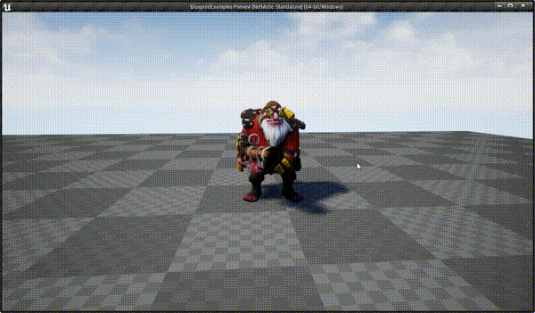
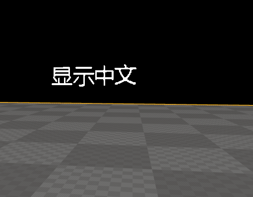
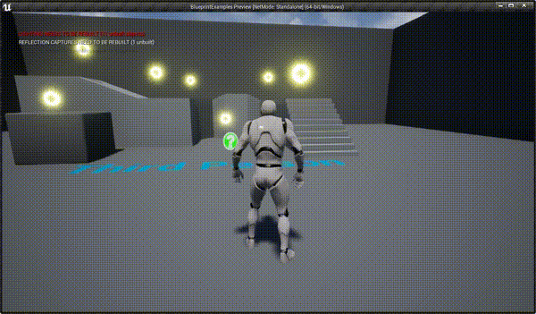

# BlueprintExamples

Developed with Unreal Engine 4.25.1

### UE提供的内容
创建第三人称模板项目，包括初学者内容，UE提供的内容并未使用git进行管理（案例积累到一定程序，到时打包完整项目，上传百度网盘），你如果clone了本项目，在运行时需要将初学者内容复制到如下目录：
#### 初学者内容
```text
    Content\UE\StarterContent
```
#### 第三人称内容
```text
    Content\UE\Geometry
    Content\UE\Mannequin
    Content\UE\ThirdPerson
    Content\UE\ThirdPersonBP
```


# 功能&小案例

## 使用UE4播放Dota2模型（狙击手）动画
3个模型动画：idle，run，death，默认动画 idle，鼠标左键点击模型进行切换。
```text
    Content\Sniper
```
效果



## TextRender显示中文

TextRender默认只支持英文显示，可以通过配置字体，设置要显示的文字，来支持中文显示，详细配置看代码吧，弊端是每个要显示的中文内容都要配置字体，尝试做通用字体失败（单个字体不支持大段内容），各位大神有好的方式请告知！

```text
	Content\ShowCN
```
效果




## 采集物
支持：人物自动吸引到采集物、吸引过程中缩放、改变颜色
```text
    Content\Gather
```
效果



## 移动的靶子
移动的靶子
```text
    Content\MovingTarget
```
效果


## 开关灯
进入桌子一定的范围，开灯，再次进入关灯
```text
    Content\OpenLight
```
效果


## 滑动UI
演示UI自动滑动
```text
    Content\MoveUI
```
效果
