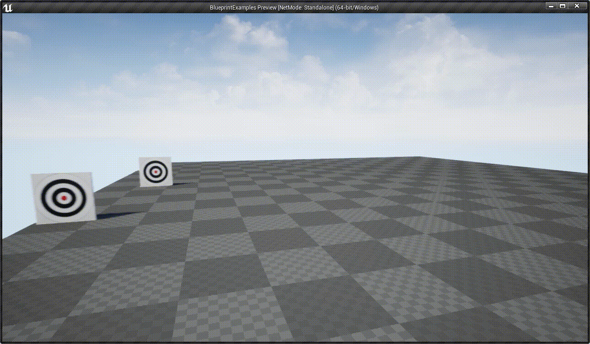

# BlueprintExamples

Developed with Unreal Engine 4.25.1

### 初学者内容
项目使用的初学者内容，但并未使用git进行管理，你如果clone了本项目，在运行时需要将初学者内容复制到如下目录：
```text
    Content\StarterContent
```


# 功能&小案例

## 移动的靶子
移动的靶子
```text
    Content\MovingTarget
```
效果



## 开关灯
进入桌子一定的范围，开灯，再次进入关灯
```text
    Content\OpenLight
```
效果


## 滑动UI
演示UI自动滑动
```text
    Content\MoveUI
```
效果
